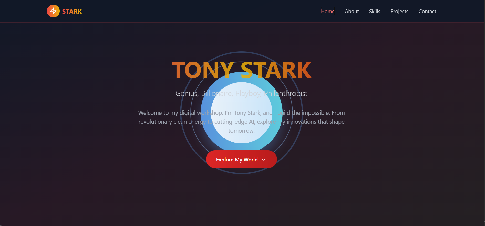

# Screenshots

Below is a screenshot of the portfolio homepage:



# Vite React TypeScript Starter

A modern, production-ready portfolio template built with React, TypeScript, Vite, and Tailwind CSS. This project showcases a personal portfolio for "Tony Stark" with beautiful animations, responsive design, and clean code structure.

## Features

- ⚡ Fast development with Vite
- ⚛️ React 18 with TypeScript
- 🎨 Tailwind CSS for rapid UI styling
- 🦾 Lucide React icons
- ✨ Responsive, animated, and modern design
- 🧑‍💻 ESLint for code quality

## Getting Started

### Prerequisites

- Node.js (v18 or newer recommended)
- npm (v9 or newer)

### Installation

1. **Clone the repository:**
   ```sh
   git clone <your-repo-url>
   cd project
   ```
2. **Install dependencies:**
   ```sh
   npm install
   ```

### Development

Start the local development server:

```sh
npm run dev
```

Visit [http://localhost:5173/](http://localhost:5173/) in your browser.

### Build for Production

To build the app for production:

```sh
npm run build
```

The output will be in the `dist/` folder.

### Preview Production Build

To locally preview the production build:

```sh
npm run preview
```

## Project Structure

```
project/
├── src/
│   ├── App.tsx         # Main React component (portfolio UI)
│   ├── index.css       # Tailwind CSS imports
│   ├── main.tsx        # React entry point
│   └── ...             # Other source files
├── index.html          # HTML template
├── tailwind.config.js  # Tailwind CSS configuration
├── postcss.config.js   # PostCSS configuration
├── package.json        # Project metadata and scripts
├── tsconfig.json       # TypeScript configuration
└── ...
```

## Customization

- Update `App.tsx` to change portfolio content, sections, and styles.
- Edit `tailwind.config.js` to customize Tailwind theme.
- Replace icons using [Lucide React](https://lucide.dev/icons/).

## Troubleshooting

- If you see a white screen, check your browser console and terminal for errors.
- If using antivirus (e.g., Kaspersky), add an exception for your project folder and `localhost:5173`.

## License

This project is for educational and personal portfolio use.

---

Built with ❤️ by Ashen for Tony Stark (and GitHub Copilot)
